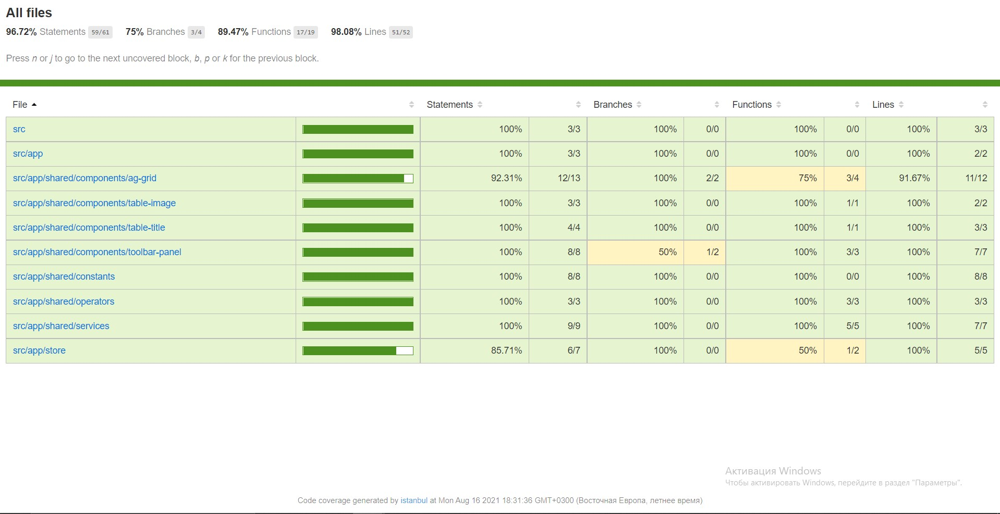

# AgGrid

## About the project

The data from API rendered in the ag-grid component. All the data represent in fields in next way:

1. "thumbnails" (default) as an image (no Column name)
2. "publishedAt" as "Published on"
3. "title" as "Video Title"
4. "description" as "Description"

User can click on the video title link, and corresponding video will be opened.

There is a toolbar in the bottom of the table. It has 3 controls:

1. Button to toggle Selection mode in agGrid
2. Total count of records in the grid
3. Selected records count.

When user switch on Selection, the additional column with checkbox is shown on the
grid for each record to enable user to select/unselect the records.

There is context menu provided for "Video title column".
That's my coverage for tests.

## Description of the requirements

1. Service with @Self decorator (There are two such services: http.service.ts and ag-grid.service.ts. They are in the shared/services and they are using in ag-grid component). 
2. Store (ngrx or another implementation of Redux). (I've used ngrx, and it's store in my test task. All the files contains in store folder).
3. Custom rxjs pipe/operator. (I used async pipe in the ag-grid component, I did operator, that contains in shared/operators as well)
4. Pure (simple, dump or input/output) component covered by unit test. (All the ts files covered by unit test, that was shown higher).

This project was generated with [Angular CLI](https://github.com/angular/angular-cli) version 12.1.4.

## Development server

Run `ng serve` for a dev server. Navigate to `http://localhost:4200/`. The app will automatically reload if you change any of the source files.

## Code scaffolding

Run `ng generate component component-name` to generate a new component. You can also use `ng generate directive|pipe|service|class|guard|interface|enum|module`.

## Build

Run `ng build` to build the project. The build artifacts will be stored in the `dist/` directory.

## Running unit tests

Run `ng test` to execute the unit tests via [Karma](https://karma-runner.github.io).

